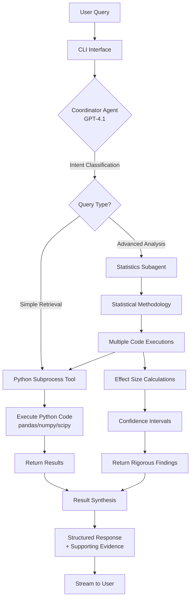
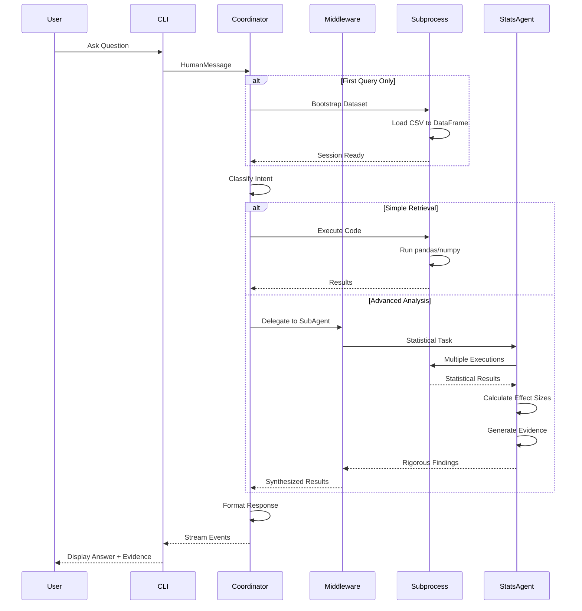

# SynMax Data Agent

A chat-based AI agent for analyzing ANY Parquet or CSV dataset. Built with a hierarchical agent architecture that combines intelligent query routing with rigorous statistical analysis.

## Table of Contents

- [Installation](#installation)
- [Quick Start](#quick-start)
- [Example Queries & Outputs](#example-queries--outputs)
- [Features](#features)
- [Architecture](#architecture)
- [Technical Details](#technical-details)

## Installation

### Prerequisites

- **Python**: 3.10 or higher
- **API Keys**: OpenAI API key (GPT-4 access required)

### Step 1: Clone Repository

```bash
git clone https://github.com/samon11/synmax-agent
cd synmax-agent
```

### Step 2: Install Python Dependencies (virtual env recommended)

```bash
pip install -r requirements.txt
```

### Step 3: Configure Environment Variables

Copy the example environment file:

```bash
cp .env.example .env
```

Edit `.env` and add your OpenAI API key and dataset path:

```bash
OPENAI_API_KEY=sk-your-key-here
DATASET_PATH=./data/dataset.parquet
```

## Quick Start

### Single Query Mode

Run one-off queries:

```bash
python cli.py --query "What is the total scheduled volume for 2023?"
```

The agent will:
1. Create a plan
2. Execute the analysis
3. Return the answer
4. Exit

### Interactive Mode

Start a conversational session:

```bash
python cli.py
```

You'll see:
```
Data Agent initialized successfully.
Dataset: data/dataset.parquet (1338 rows, 7 columns)

Ask a question (or type 'quit' to exit):
>
```

Exit with `quit` or `exit`.


## Example Queries & Outputs

### State Volume Analysis

**Query:**
```
Which state had the highest total volume for 2024?
```

**Answer:**
Louisiana (LA) had the highest total scheduled gas volume in 2024, with approximately 25.1 billion units.

**Supporting Evidence:**
- **Methods**: Filtered 2024 records, grouped by state_abb, and summed scheduled_quantity to find the top state.
- **Columns**: state_abb, scheduled_quantity, eff_gas_day
- **Key Findings**: LA total scheduled_quantity ≈ 25,119,300,000; 48 states had non-null data for 2024.
- **Limitations**: Some records lacked state_abb (nulls), but these were excluded from the ranking.
- **Notable Insights**: Louisiana's volume far exceeded other states, indicating its central role in 2024 pipeline activity.

### Pipeline Network Bottleneck Analysis

**Query:**
```
Can you identify potential bottlenecks in the pipeline network based on delivery vs receipt imbalances?
```

**Answer:**
Several potential bottlenecks in the pipeline network are identifiable based on persistent delivery vs receipt imbalances, especially at storage facilities and key compressor stations. The most significant bottlenecks are found at storage-related locations (e.g., Dominion Transmission, Columbia Gas, Questar Pipeline) and compressor stations on the Transcontinental Gas Pipe Line, where large, consistent net imbalances suggest operational constraints or directional flow issues.

**Supporting Evidence:**
- **Methods**: Pattern recognition and anomaly detection on net scheduled quantity (receipts minus deliveries) by location; consistency measured by std/abs_mean.
- **Columns**: pipeline_name, loc_name, rec_del_sign, scheduled_quantity, eff_gas_day.
- **Key Findings**: Top bottlenecks include Dominion Transmission (mean net imbalance: 153M), Columbia Gas (133M), and several Transco compressor stations (mean net imbalances: ±2.8M to ±3.0M), all with high persistence (consistency < 0.5).
- **Limitations**: 100% missing latitude/longitude and high missing rates for network connection columns limit spatial and network mapping.
- **Notable Insights**: Storage operations and compressor stations are the most common sites of persistent imbalances, indicating these are critical points for monitoring and potential intervention in the pipeline network.

### Pipeline Operations Analysis

**Query:**
```
Find any pipelines that suddenly stopped or started operations during the time period.
```

**Answer:**
Several pipelines experienced sudden starts or stops in operations during the analyzed period. For example, the Arkoma Pipeline stopped on 2022-10-13 and restarted on 2022-10-21, while Blue Lake Gas Storage Company had multiple start and stop events across 2022–2025. In total, 30 pipelines showed 116 such events, each defined by a sustained transition (at least 7 days) from zero to nonzero scheduled quantity (start) or vice versa (stop).

**Supporting Evidence:**
- **Methods**: Time series anomaly detection on daily scheduled_quantity per pipeline, identifying sustained transitions (≥7 days) between operational and non-operational states.
- **Columns**: pipeline_name, eff_gas_day, scheduled_quantity
- **Key Findings**: 30 pipelines with sudden starts/stops; 116 total events; examples include Arkoma Pipeline (stop: 2022-10-13, start: 2022-10-21) and Blue Lake Gas Storage Company (multiple events).
- **Limitations**: Some pipelines have missing days in their records (e.g., Gasoducto Rosarito missing 765 days), which may affect detection accuracy.
- **Notable Insights**: Operational changes are not rare and may reflect maintenance, outages, or market-driven pauses; data gaps could obscure some events.

### Year-over-Year Comparison

**Query:**
```
Compare 2022 vs 2023 - what changed in terms of volume, active pipelines, and geographic distribution?
```

**Answer:**
In 2023, total scheduled gas volume decreased by about 21% compared to 2022 (from 299.6 billion to 237.7 billion), while the number of active pipelines slightly increased (from 161 to 165). The geographic distribution by state remained broadly similar, but some counties shifted in prominence—Daggett County led in 2022, while Cameron Parish and Greene County topped the list in 2023.

**Supporting Evidence:**
- **Methods**: Year-based filtering, aggregation of scheduled gas volume, unique pipeline counts, and top geographic contributors by state and county.
- **Columns**: year (from eff_gas_day), scheduled_quantity, pipeline_name, state_abb, county_name
- **Key Findings**:
  - Total scheduled volume: 2022 = 299.6B, 2023 = 237.7B
  - Active pipelines: 2022 = 161, 2023 = 165
  - Top counties shifted: Daggett (2022) to Cameron Parish/Greene (2023)
- **Limitations**: County and state-level results may be affected by missing location data; only top 10 counties shown for each year.


## Features

- **Natural Language Interface**: Ask questions in plain English
- **Intelligent Query Routing**: Automatically distinguishes simple retrieval from advanced statistical analysis
- **Rigorous Statistical Analysis**:
  - Proper categorical variable handling (binary, nominal, ordinal)
  - Effect size calculations with confidence intervals
  - Correlation, regression, ANOVA, clustering, and anomaly detection
- **Secure Code Execution**: Python code execution using subprocess isolation
- **Real-time Streaming**: See analysis progress as it happens

## Architecture

### Overview

The system uses a **hierarchical ReAct (Reasoning + Acting) agent architecture** with two specialized agents:



### Key Components

#### 1. Coordinator Agent (`agent/root.py`)
- **Role**: Query classification and routing
- **Responsibilities**:
  - Distinguish simple vs. advanced queries
  - Handle basic data retrieval directly
  - Delegate complex statistical tasks to specialist
  - Synthesize results into structured responses

#### 2. Statistics Subagent
- **Role**: Expert statistician for advanced analysis
- **Capabilities**:
  - Pattern recognition (clustering, correlations, trends)
  - Anomaly detection (outliers, rule violations)
  - Causal hypothesis generation (with evidence and caveats)
  - Proper statistical methodology enforcement

#### 3. Python Subprocess Executor (`agent/tools.py`)
- **Role**: Python code execution environment
- **Features**:
  - Executes Python code via subprocess isolation
  - Stateful session persistence across queries
  - Pre-loaded dataset as pandas DataFrame
  - Full pandas/numpy/scipy/scikit-learn support
  - Direct access to local Python environment

### Data Flow



### Middleware Stack

The ReAct agent uses a sophisticated middleware stack for enhanced capabilities:


**Middleware Responsibilities**:
- **TodoListMiddleware**: Tracks task progress and sub-steps
- **SubAgentMiddleware**: Enables delegation to specialized statistics agent
- **SummarizationMiddleware**: Auto-summarizes at 85% context (keeps last 10% of messages)
- **PromptCachingMiddleware**: Caches system prompts for performance
- **PatchToolCallsMiddleware**: Ensures reliable tool call execution
- **HumanInTheLoopMiddleware**: Optional approval gates for sensitive operations

### Statistical Rigor

The statistics subagent enforces best practices for categorical variables:

| Variable Type | Encoding | Analysis Method | Effect Size |
|---------------|----------|-----------------|-------------|
| Binary (2 categories) | 0/1 encoding | Point-biserial correlation | R² = correlation² |
| Nominal (unordered) | One-hot encoding | ANOVA | R² = eta-squared |
| Ordinal (ordered) | Label encoding | Spearman correlation | R² = rho² |

**Key Safeguards**:
- Prevents treating nominal variables as ordinal (false ordering)
- Requires assumption validation (normality, homoscedasticity)
- Uses non-parametric alternatives when assumptions violated
- Reports confidence intervals and practical significance
- Hedges causal claims with evidence and limitations

## Technical Details

### Security
- **Subprocess isolation**: Python code executes in separate subprocess
- **API keys**: Stored in `.env` (ensure not committed to version control)
- **Code injection**: LLM-generated code could theoretically contain malicious logic
  (review generated code before executing in production environments)

### Known Issues

1. **Very long numerical outputs** may be truncated by the subprocess output capture
2. **Matplotlib plots** cannot be displayed in CLI (text-only interface)
3. **Large dataset operations** (e.g., 10,000+ row permutation tests) may timeout
4. **Conversation context** exceeding 100K tokens triggers auto-summarization (may lose nuance)

### Model Configuration

- **Primary LLM**: OpenAI GPT-4.1 (model: `gpt-4.1`, temperature: 0.0)
- **Rationale**: Low temperature ensures deterministic, accurate responses for data analysis
- **Token limits**: ~128K input context, 4K output tokens

### Dependencies

Key libraries (143 total packages):

```
langgraph==1.0.5           # Agent orchestration
langchain==1.2.0           # LLM abstractions
langchain-openai==1.1.6    # OpenAI integration
deepagents==0.3.1          # ReAct agent framework
pandas==2.3.3              # Data manipulation
numpy==2.4.0               # Numerical computing
scikit-learn==1.6.1        # Machine learning
scipy==1.15.1              # Statistical functions
```

See `requirements.txt` for complete list.

### Observability (Optional)

The agent supports optional Langfuse integration for monitoring:
- Traces all LLM calls and tool executions
- Measures query latency (speed = 30% of evaluation score)
- Provides debugging insights for complex workflows

To enable:
1. Sign up at https://cloud.langfuse.com
2. Add environment variables to `.env`:
   ```bash
   LANGFUSE_PUBLIC_KEY=pk-lf-...
   LANGFUSE_SECRET_KEY=sk-lf-...
   LANGFUSE_HOST=https://cloud.langfuse.com
   ```

### Project Structure

```
synmax-agent/
├── agent/
│   ├── root.py              # Main DataAgent orchestrator
│   ├── react_agent.py       # ReAct agent with middleware stack
│   ├── prompts.py           # System prompts (coordinator + stats agent)
│   └── tools.py             # Python subprocess execution tool
├── cli.py                   # Command-line interface
├── data/                    # Dataset storage (gitignored)
│   ├── medical.csv          # Insurance dataset (not in repo)
│   └── SAMPLE_QUERIES.txt   # Example questions
├── requirements.txt         # Python dependencies
├── .env.example            # Environment template
├── .gitignore              # Excludes data/ and .env
└── README.md               # This file
```

