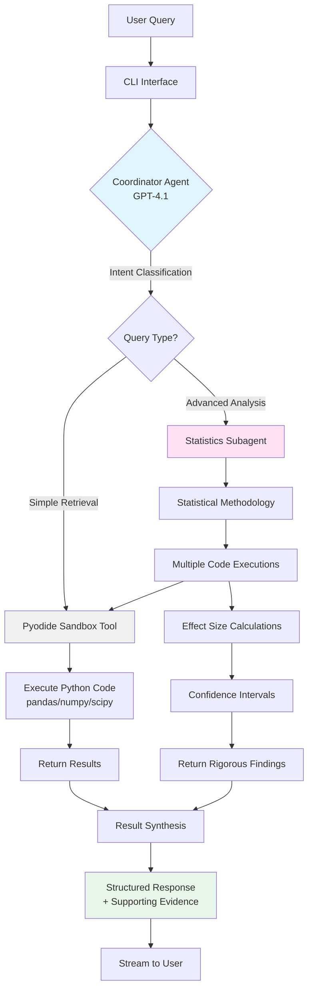
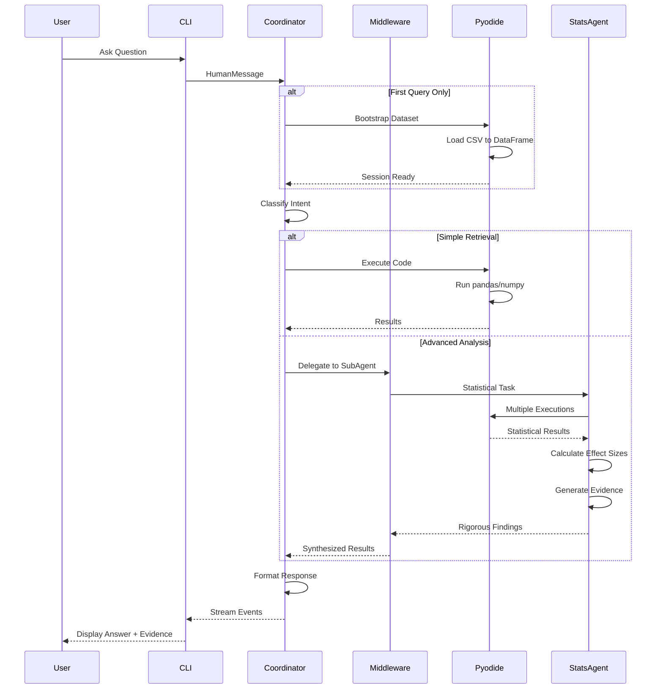

# SynMax Data Agent

A chat-based AI agent for analyzing any CSV dataset. Built with a hierarchical agent architecture that combines intelligent query routing with rigorous statistical analysis.

## Table of Contents

- [Features](#features)
- [Architecture](#architecture)
- [Installation](#installation)
- [Quick Start](#quick-start)
- [Example Queries & Outputs](#example-queries--outputs)
- [Dataset Setup](#dataset-setup)
- [Technical Details](#technical-details)

## Features

- **Natural Language Interface**: Ask questions in plain English
- **Intelligent Query Routing**: Automatically distinguishes simple retrieval from advanced statistical analysis
- **Rigorous Statistical Analysis**:
  - Proper categorical variable handling (binary, nominal, ordinal)
  - Effect size calculations with confidence intervals
  - Correlation, regression, ANOVA, clustering, and anomaly detection
- **Secure Code Execution**: Sandboxed Python environment using Pyodide (WebAssembly)
- **Conversational Memory**: Maintains context across multiple questions
- **Real-time Streaming**: See analysis progress as it happens

## Architecture

### Overview

The system uses a **hierarchical ReAct (Reasoning + Acting) agent architecture** with two specialized agents:



### Key Components

#### 1. Coordinator Agent (`agent/root.py`)
- **Role**: Query classification and routing
- **Responsibilities**:
  - Distinguish simple vs. advanced queries
  - Handle basic data retrieval directly
  - Delegate complex statistical tasks to specialist
  - Synthesize results into structured responses

#### 2. Statistics Subagent
- **Role**: Expert statistician for advanced analysis
- **Capabilities**:
  - Pattern recognition (clustering, correlations, trends)
  - Anomaly detection (outliers, rule violations)
  - Causal hypothesis generation (with evidence and caveats)
  - Proper statistical methodology enforcement

#### 3. Pyodide Sandbox (`agent/tools.py`)
- **Role**: Secure Python code execution environment
- **Features**:
  - Runs Python in WebAssembly (browser-like sandbox)
  - Stateful session persistence across queries
  - Pre-loaded dataset as pandas DataFrame
  - No file system or network access
  - Full pandas/numpy/scipy/scikit-learn support

### Data Flow



### Middleware Stack

The ReAct agent uses a sophisticated middleware stack for enhanced capabilities:


**Middleware Responsibilities**:
- **TodoListMiddleware**: Tracks task progress and sub-steps
- **SubAgentMiddleware**: Enables delegation to specialized statistics agent
- **SummarizationMiddleware**: Auto-summarizes at 85% context (keeps last 10% of messages)
- **PromptCachingMiddleware**: Caches system prompts for performance
- **PatchToolCallsMiddleware**: Ensures reliable tool call execution
- **HumanInTheLoopMiddleware**: Optional approval gates for sensitive operations

### Statistical Rigor

The statistics subagent enforces best practices for categorical variables:

| Variable Type | Encoding | Analysis Method | Effect Size |
|---------------|----------|-----------------|-------------|
| Binary (2 categories) | 0/1 encoding | Point-biserial correlation | R² = correlation² |
| Nominal (unordered) | One-hot encoding | ANOVA | R² = eta-squared |
| Ordinal (ordered) | Label encoding | Spearman correlation | R² = rho² |

**Key Safeguards**:
- Prevents treating nominal variables as ordinal (false ordering)
- Requires assumption validation (normality, homoscedasticity)
- Uses non-parametric alternatives when assumptions violated
- Reports confidence intervals and practical significance
- Hedges causal claims with evidence and limitations

## Installation

### Prerequisites

- **Python**: 3.10 or higher
- **Deno**: JavaScript/TypeScript runtime (required for Pyodide sandbox)
- **API Keys**: OpenAI API key (GPT-4 access required)

### Step 1: Install Deno

Deno is a secure JavaScript/TypeScript runtime that powers the Pyodide sandbox environment. It provides:
- WebAssembly support for running Python in isolation
- Secure sandboxing with no file/network access by default
- Fast startup and execution times

Install Deno using the official installer:

```bash
curl -fsSL https://deno.land/install.sh | sh
```

### Step 2: Clone Repository

```bash
git clone https://github.com/yourusername/synmax-agent.git
cd synmax-agent
```

### Step 3: Install Python Dependencies

```bash
pip install -r requirements.txt
```

### Step 4: Configure Environment Variables

Copy the example environment file:

```bash
cp .env.example .env
```

Edit `.env` and add your OpenAI API key and dataset path:

```bash
OPENAI_API_KEY=sk-your-key-here
DATASET_PATH=./data/dataset.csv
```

### Step 5: Setup Dataset

See [Dataset Setup](#dataset-setup) section below.

## Quick Start

### Interactive Mode (Recommended)

Start a conversational session:

```bash
python cli.py
```

You'll see:
```
Data Agent initialized successfully.
Dataset: data/medical.csv (1338 rows, 7 columns)

Ask a question (or type 'quit' to exit):
>
```

Ask questions naturally:
```
> How many smokers are in the dataset?
> What is the correlation between BMI and charges?
> Are there any unusual patterns in charges by region?
```

Exit with `quit` or `exit`.

### Single Query Mode

Run one-off queries:

```bash
python cli.py --query "What is the average age of smokers vs non-smokers?"
```

The agent will:
1. Create a plan
2. Execute the analysis
3. Return the answer
4. Exit

## Example Queries & Outputs
TODO

## Dataset Setup

The dataset is NOT included in this repository per assignment requirements. 

1. Place the `dataset.csv` in the `data/` directory:
2. The agent will automatically detect it on startup
3. Update .env DATASET_PATH=data/dataset.csv


#### 8. Security
- **Sandboxed execution**: Pyodide has no file system or network access
- **API keys**: Stored in `.env` (ensure not committed to version control)
- **Code injection**: LLM-generated code could theoretically contain malicious logic
  (mitigated by sandbox and code review prompts)

### Known Issues

1. **Very long numerical outputs** may be truncated by the Pyodide sandbox
2. **Matplotlib plots** cannot be displayed in CLI (text-only interface)
3. **Large dataset operations** (e.g., 10,000+ row permutation tests) may timeout
4. **Conversation context** exceeding 100K tokens triggers auto-summarization (may lose nuance)

## Technical Details

### Model Configuration

- **Primary LLM**: OpenAI GPT-4.1 (model: `gpt-4.1`, temperature: 0.1)
- **Rationale**: Low temperature ensures deterministic, accurate responses for data analysis
- **Token limits**: ~128K input context, 4K output tokens

### Dependencies

Key libraries (143 total packages):

```
langgraph==1.0.5           # Agent orchestration
langchain==1.2.0           # LLM abstractions
langchain-openai==1.1.6    # OpenAI integration
deepagents==0.3.1          # ReAct agent framework
langchain-sandbox==0.0.6   # Pyodide sandboxing
pandas==2.3.3              # Data manipulation
numpy==2.4.0               # Numerical computing
scikit-learn==1.6.1        # Machine learning
scipy==1.15.1              # Statistical functions
```

See `requirements.txt` for complete list.

### Observability (Optional)

The agent supports optional Langfuse integration for monitoring:
- Traces all LLM calls and tool executions
- Measures query latency (speed = 30% of evaluation score)
- Provides debugging insights for complex workflows

To enable:
1. Sign up at https://cloud.langfuse.com
2. Add environment variables to `.env`:
   ```bash
   LANGFUSE_PUBLIC_KEY=pk-lf-...
   LANGFUSE_SECRET_KEY=sk-lf-...
   LANGFUSE_HOST=https://cloud.langfuse.com
   ```

### Project Structure

```
synmax-agent/
├── agent/
│   ├── root.py              # Main DataAgent orchestrator
│   ├── react_agent.py       # ReAct agent with middleware stack
│   ├── prompts.py           # System prompts (coordinator + stats agent)
│   └── tools.py             # Pyodide sandbox tool
├── cli.py                   # Command-line interface
├── data/                    # Dataset storage (gitignored)
│   ├── medical.csv          # Insurance dataset (not in repo)
│   └── SAMPLE_QUERIES.txt   # Example questions
├── requirements.txt         # Python dependencies
├── .env.example            # Environment template
├── .gitignore              # Excludes data/ and .env
└── README.md               # This file
```

